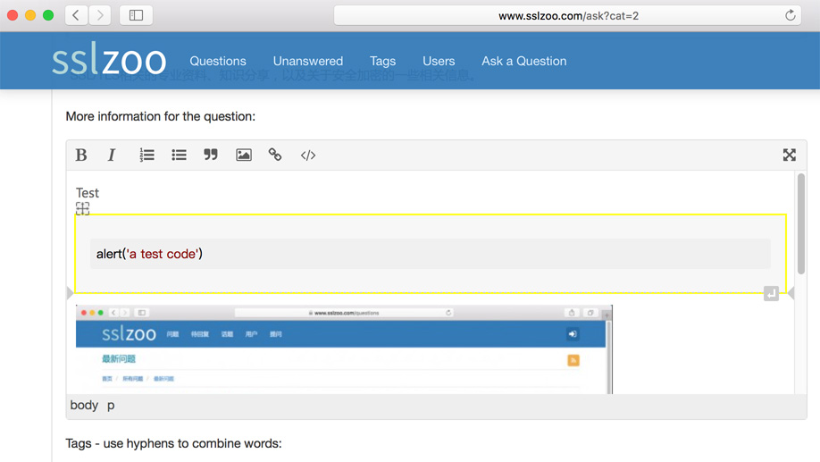

# Special q2a ckeditor

A special ckeditor for Question2Answer in sslzoo.com

## Demo

Visit http://www.sslzoo.com

## Usage

1. Download packages and replace folder `/qa-plugin/wysiwyg-editor`
2. Refresh site page.

-----

## 简体中文

Question2Answer 中的编辑器基于 ckeditor 重新定制

* 支持粗体、斜体、有序列表、无序列表、引用、上传图片、超链、插入代码
* 全屏编辑
* 支持 ckeditor 的大多数配置

演示：访问 http://www.sslzoo.com 后注册账号再提问就可以看到效果了。

## License

This program is free software; you can redistribute it and/or modify it under the terms of the GNU General Public License as published by the Free Software Foundation; either version 2 of the License, or (at your option) any later version.
